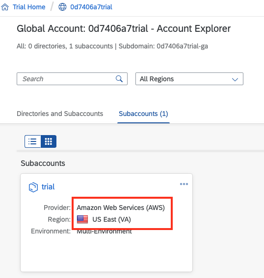
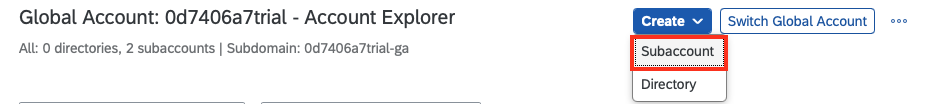
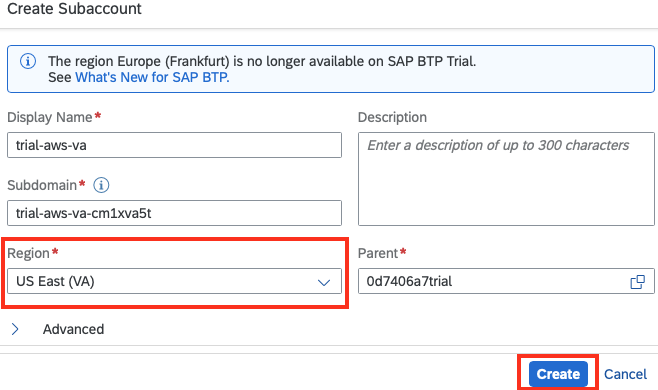
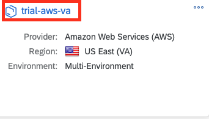
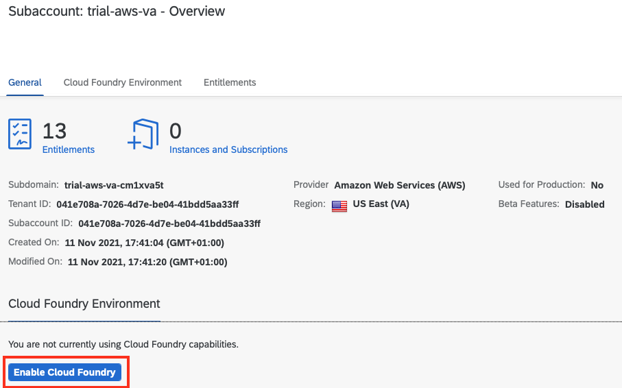
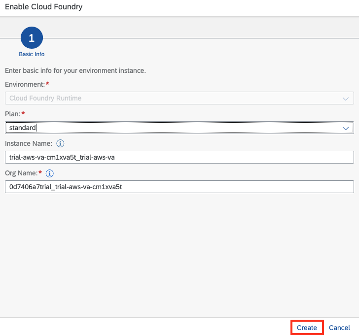
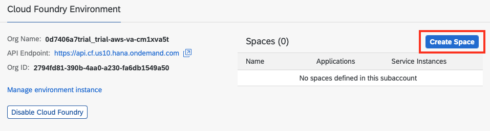
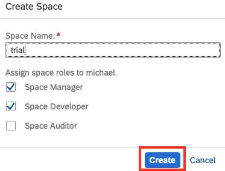

# Check your existing trial account

If you have already created a trial account in the past, we need to
ensure that have a subaccount in the **US East (VA) - AWS**
region.
To confirm this, log in to your [Trial Account](https://cockpit.us10.hana.ondemand.com/trial/)
and inspect the list of subaccounts.

You should have at least one subaccount where the **region** field is listed as
**US East (VA) - AWS** as shown below:

Note that the **Singapore - Microsoft Azure** is currently **not** supported.

If you have a subaccount in the correct region, please proceed with the
[exercises](/README.md#exercises).

## Subaccount in region other than US East (VA) - AWS

However, if your subaccount is not in a supported region has a different region, please create a
new subaccount by clicking the "New Subaccount" button.

In the resulting popup, enter a **Display Name**,
select the **US East (VA) - AWS** region and enter
a valid **subdomain** name. The name should be unique, so it is OK
to be creative here. Once you entered all details, click the
"Create" button.

Once the new subaccount is created, click on the name to enter the
subaccount.

Click the "Enable Cloud Foundry" button.

In the resulting popup, accept the default org name and click the "Create" button.

Once Cloud Foundry is available, click the "Create Space" button:

Enter a name for the new Cloud Foundry space. "trial" is a good choice.
Then, click "Create".

Once the space is created successfully, navigate back to your [main
trial global account](https://cockpit.eu10.hana.ondemand.com/trial/).

You are now ready to proceed with the [exercises](/README.md#exercises).
