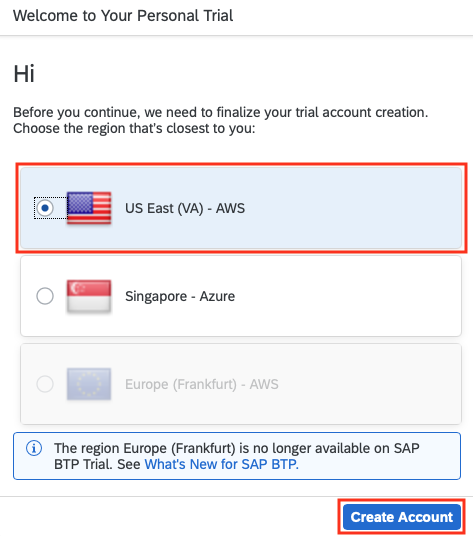

# Creating a new SAP Business Technology Platform Trial account

Go to the [SAP Business Technology Platform Trial page](https://account.hanatrial.ondemand.com/)
to create your trial account.

If are participating in the workshop, you should already be able to login to this
page and create your account. If you do not yet have a login, please see the tutorial
["Get a Free Account on SAP BTP Trial"](https://developers.sap.com/tutorials/hcp-create-trial-account.html)
to learn how to create a Trial account.

Regions other than **US East (VA) - AWS** are currently not supported. For this reason, make sure
to select the correct region while creating your trial account:

You are now ready to proceed with the [exercises](/README.md#exercises).
